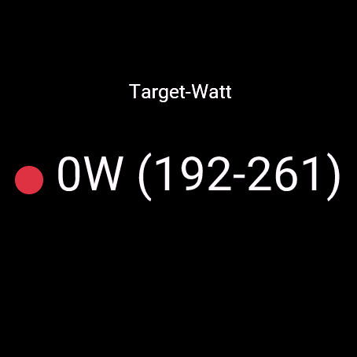

# ctpView Power‑HR Zone Mapping for Garmin

This repository contains a Garmin Connect IQ data field (`ctpView`) that maps heart‑rate–based workout steps into power‑based pacing targets in real time. By combining the watch’s built‑in run HR zones with user‑configured FTP (Functional Threshold Power) zones, `ctpView` displays a green/red live indicator showing whether you’re hitting the intended power range for each workout segment.

| **HR Zone** | **HR %LTHR** | **Example HR (bpm)** | **Power Zone** | **%FTP**    | **Example Power (W)** |
|-------------|--------------|----------------------|----------------|-------------|-----------------------|
| Zone 1      | < 85 %       | < 148                | Zone 1         | < 55 %      | < 191                 |
| Zone 2      | 85 – 89 %    | 148 – 155            | Zone 2         | 56 – 75 %   | 195 – 261             |
| Zone 3      | 90 – 93 %    | 157 – 162            | Zone 3         | 76 – 89 %   | 264 – 310             |
| Zone 4      | 94 – 97 %    | 164 – 169            | Zone 4         | 90 – 105 %  | 313 – 366             |
| Zone 5      | > 97 %       | > 169                | Zone 5         | 106 – 120 % | 369 – 418             |



## Features

* **Dual Mapping**: Converts HR‑target workout steps into matching power zones using device‑detected run HR zones.
* **5‑Second Rolling Average**: Smooths instantaneous power readings over a 5 s circular buffer for stable feedback.
* **Configurable FTP Zones**: Users supply their FTP and custom zone percentages via app properties; defaults provided.
* **ZoneBoundaries Class**: Encapsulates each zone’s HR min/max and power low/high for clean, maintainable logic.
* **Graceful Fallbacks**: Handles missing FTP, missing device HR zones, and out‑of‑range HR with clear error messages.
* **Debug Logging**: Extensive `System.println` calls can be gated for troubleshooting (via a debug flag).

## Installation

1. **Clone the repo**

   ```bash
   git clone https://your.git.repo/ctpView.git
   cd ctpView
   ```
2. **Open in Visual Studio Code**

   * Ensure you have the Garmin Connect IQ extension installed in VS Code.
   * Open the `ctpView` folder as a workspace in VS Code.
3. **Build & Deploy**

   * Use the Connect IQ extension's build commands to compile for your target device (e.g., vívoactive 4, Forerunner 945).
   * Deploy the `.iq` package to your watch via USB or Bluetooth.

## Configuration

`ctpView` reads the following properties from `resources/properties.xml` or user settings:

| Property               | Description               | Default |
| ---------------------- | ------------------------- | ------- |
| `thresholdPower`       | Your FTP (W)              | 348     |
| `powerZone1MinPercent` | Z1 lower bound (% of FTP) | 0       |
| `powerZone1MaxPercent` | Z1 upper bound (% of FTP) | 55      |
| `powerZone2MaxPercent` | Z2 upper bound (% of FTP) | 75      |
| `powerZone3MaxPercent` | Z3 upper bound (% of FTP) | 90      |
| `powerZone4MaxPercent` | Z4 upper bound (% of FTP) | 105     |
| `powerZone5MaxPercent` | Z5 upper bound (% of FTP) | 120     |

To modify these, edit `properties.xml` or adjust in Garmin Connect under data field settings.

## Usage

1. Add the **`ctpView`** data field to your running activity profile on the watch.
2. During a workout with **heart‑rate–based steps**, the field will:

   * Read the current step’s HR targets.
   * Find the matching HR zone from the watch’s stored zones.
   * Lookup the corresponding power band (W).
   * Display `🟢` if your 5 s avg power is inside the band, or `🔴` if outside.
3. For **power‑based steps**, it uses the step’s power bounds directly.

The display shows:

```
🟢 275W (264–310)
```

where `275W` is your current (smoothed) power, and `(264–310)` is the target band.

## Extending & Debugging


* **Adjust Sample Window**: Change `POWER_SAMPLE_COUNT` for longer/shorter smoothing.
* **Enable/Disable Logging**: Wrap `System.println` calls behind a `DEBUG` flag in `initialize()`.
* **Open‑ended Zone 5**: To allow unlimited upper range, set Zone 5 `wMax` to a high sentinel (e.g., `9999`).
* **Fallback Logic**: Implement a fallback from device HR zones to fixed %LTHR bands if `getHeartRateZones` returns null.

## License

This project is licensed under the MIT License. See [LICENSE](LICENSE) for details.

---

*— Happy training!*
